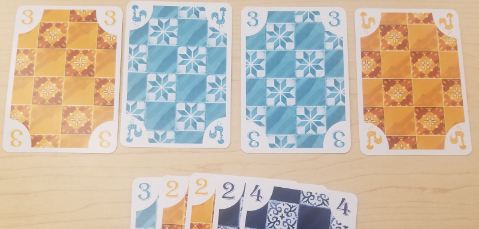
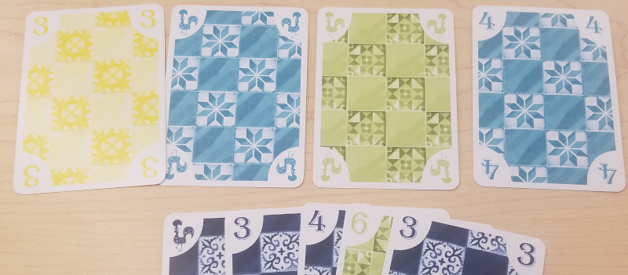

# 5211 Encoding Protocol

In this document, we define a protocol for digitally representing 5211 Cards.

## Card

A card has two important properties: Color and Value. In this protocol, a card
single card is represented using a byte (8-bits). The first nibble (4-bits)
stores the color value and the second nibble (4-bits) stores the value of the
card.

The color value is enumerated in the following order:

```
0. Yellow (0b0000)
1. Green  (0b0001)
2. Blue   (0b0010)
3. Orange (0b0011)
4. Black  (0b0100)
```

The card value will be represented simply as the cards value.

### Binary Examples

* `0b0000_0001` - Yellow Rooster
* `0b0010_0100` - Blue Five
* `0b0011_0011` - Orange Three
* `0b0101_0001` - Invalid Card

### Hexadecimal Examples

* `0x01` - Yellow Rooster
* `0x25` - Blue Five
* `0x34` - Orange Three
* `0x61` - Invalid Card

## Hand

A hand contains 5 cards. This is represented using 8 bytes. The first 3 bytes
are ignored. Each of the last 5 bytes represents one of the 5 cards.

### Examples
* `0x00_00_00_01_25_34_31_43` - Yellow Rooster, Blue Five, Orange Four, Orange Rooster, Black Three
* `0x00_00_00_41_41_31_31_06` - Black Rooster, Black Rooster, Orange Rooster, Orange Rooster, Yellow Six
* `0x00_00_00_12_23_34_45_06` - Green Two, Blue Three, Orange Four, Black Five, Yellow Six
* `0x00_00_00_51_32_43_21_11` - Invalid hand


## Player Board 

A player's board is the area in front of them where their cards are played face
down and then turned face up. This is represented by 8 bytes. Each card is
represented as a pair of bytes. The first byte is either 0 (face-down) or 1
(face-up). The second byte is a card.

The bytes are ordered such that the first card played is stored in the the
highest 2-bytes and the last card played is stored in the lowest 2-bytes. If a
card has not yet been played in one of the positions, that is represented as
`0x0000`.

### Examples
* `0x0000_0000_0000_0000` - No cards have been played.
* `0x0001_0025_0000_0000` - A Yellow Rooster and a Blue Five are in play face-down.
* `0x0101_0125_0000_0000` - A Yellow Rooster and a Blue Five are in play face-up.
* `0x0101_0125_0034_0000` - A Yellow Rooster and a Blue Five are in play face-up and an
  Orange Three is in play face-down.
* `0x0101_0125_0134_0006` - A Yellow Rooster, a Blue Five, and an Orange Three are in play
  face-up and a Yellow Six is in play face-down.
* `0x0101_0125_0134_0106` - A Yellow Rooster, Blue Five, an Orange Three, and a Yellow Six are
  in play face-up.

## 2 Player Board State

A 2 player board state contains information about the hands and boards of 2
players. This is represented using 32 bytes.

* The first 8 bytes is the first player's hand
* The second 8 bytes is the first player's board
* The third 8 bytes is the second player's hand
* The fourth 8 bytes is the second player's board

#### Player 1's Board / Hand


* `0x0000_0023_3232_4244` (Hand)
* `0x0133_0121_0123_0131` (Board)

#### Player 2's Board / Hand

* `0x0000_0041_4344_1643` (Hand)
* `0x0103_0121_0111_0124` (Board)

All together:
* `0x0000002332324244_0133012101230131_0000004143441643_0103012101110124`